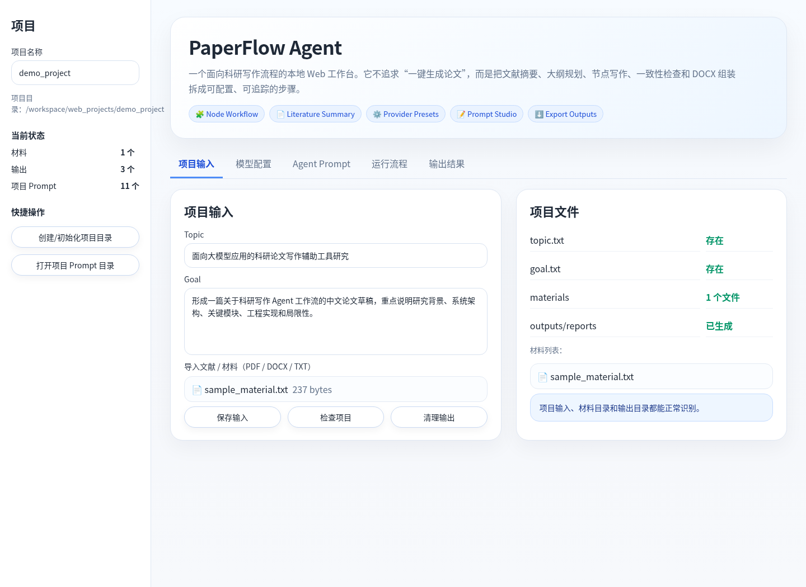
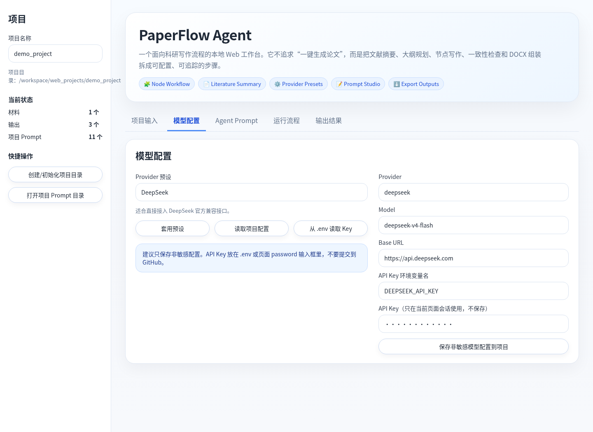
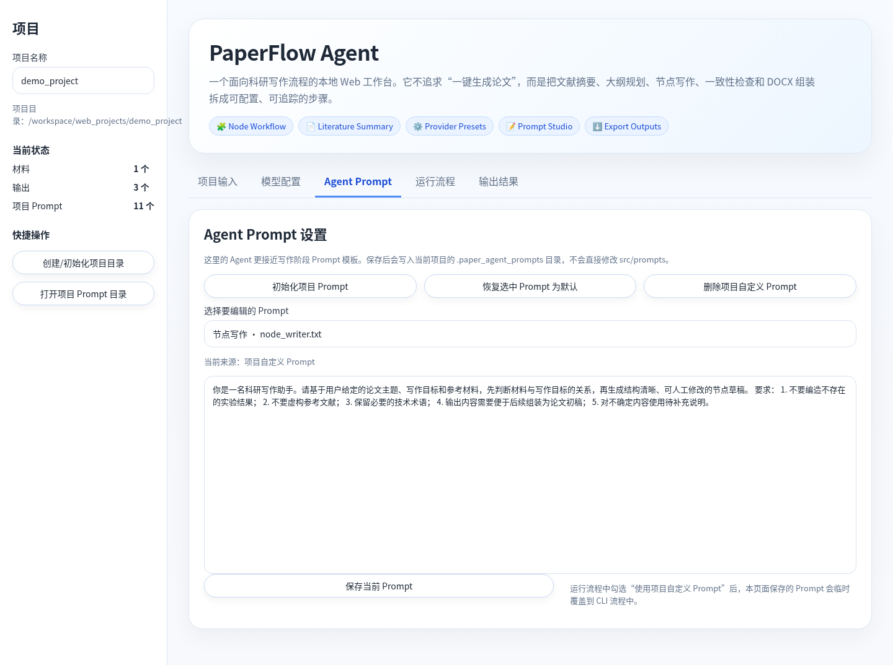
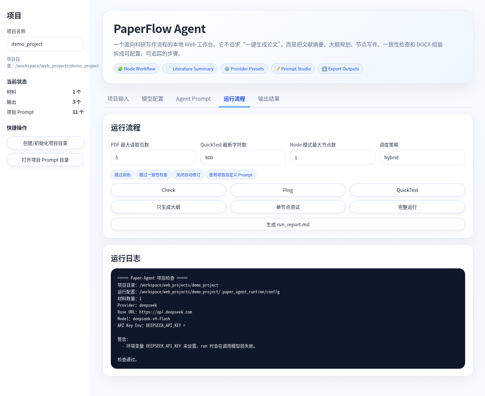
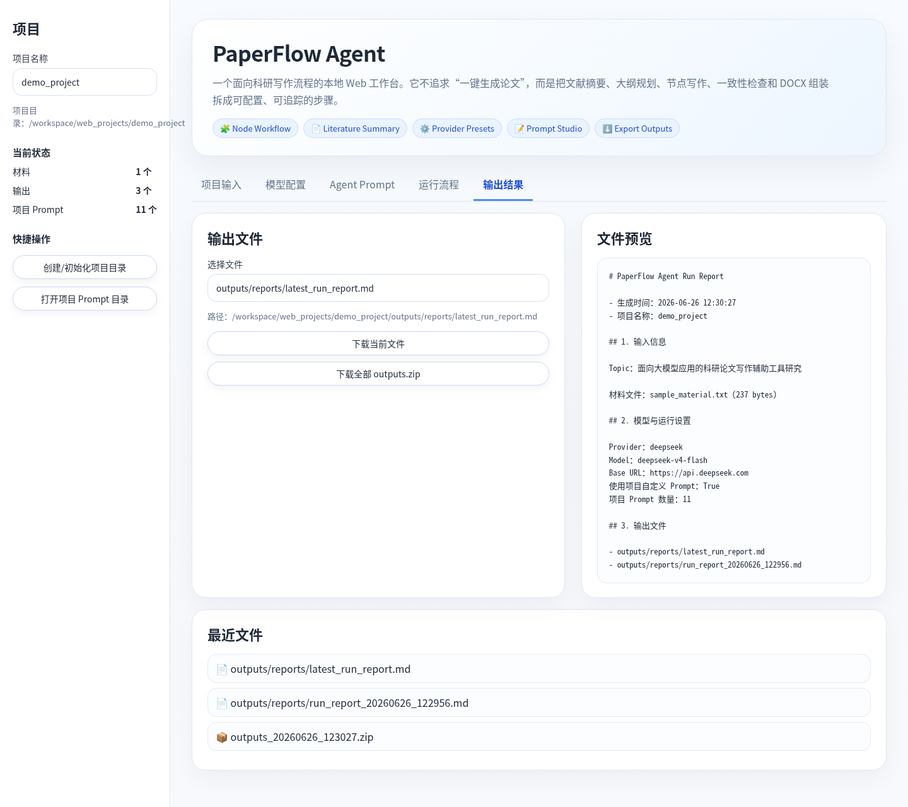

# PaperFlow Agent

PaperFlow Agent 是一个科研论文写作辅助工具。

通常用户用大模型辅助写论文时，如果直接把“帮我写一篇论文”丢给模型，结果通常并不好。模型很容易写得很顺，但结构不稳定，前后重复，章节之间也容易脱节。尤其是论文这种长文本任务，一次性生成整篇文章并不适合后续修改。

所以把论文写作拆开处理：先整理材料，再生成大纲，再拆成节点，再按节点写草稿，最后再做一致性检查和组装。这样每一步都有中间结果，自己也能随时停下来检查，而不是等模型一次性吐出一大段很难改的内容。

这个项目不是“一键生成论文”的工具，也不建议把生成内容直接当成最终稿。它更像是一个本地科研写作工作台，用来辅助文献整理、大纲规划、章节初稿和写作流程管理。

## 截图

### 项目输入



### 模型配置



### Agent Prompt 编辑



### 运行流程



### 输出结果预览



## 现在能做什么

目前这个项目主要支持这些功能：

* 用项目目录管理一次论文写作任务；
* 保存论文主题、写作目标和参考材料；
* 支持导入 PDF、DOCX、TXT 材料；
* 支持 DeepSeek 和 OpenAI-compatible API；
* 支持模型连接测试；
* 支持 QuickTest，先用少量材料测试流程是否正常；
* 支持文献摘要；
* 支持结构化大纲生成；
* 支持节点卡片生成；
* 支持按节点生成章节草稿；
* 支持可选的节点润色、一致性检查和自动修订；
* 支持 DOCX 草稿组装；
* 支持 Web 页面上传材料、配置模型、编辑 Prompt、运行流程和查看输出；
* 支持生成 `run_report.md`，记录一次运行的配置和输出文件。

我自己使用时，一般不会直接跑完整流程，而是先跑 `check`、`ping`、`quicktest`，确认材料读取和模型调用没问题，再跑大纲或单节点测试。

## 为什么要做成节点流程

论文写作不是一个简单的“输入题目，输出全文”的任务。实际写作时，很多内容需要反复调整，比如：

* 题目和研究目标是否一致；
* 大纲是否能支撑整篇文章；
* 每个章节有没有重复；
* 方法、实验、结论之间有没有断裂；
* 引用材料是否真正被用上；
* 某一节写得不对时能否单独修改。

所以这个项目把写作过程拆成几个阶段：

```text
材料读取
  ↓
文献摘要
  ↓
大纲规划
  ↓
节点卡片
  ↓
节点写作
  ↓
节点润色
  ↓
一致性检查
  ↓
自动修订
  ↓
DOCX 组装
```

这样做的好处是，中间结果都可以保留下来。哪一步效果不好，就只改那一步，不需要整篇推倒重来。

## 项目结构

```text
paperflow-agent/
├── paper_agent.py              # CLI 入口
├── web_app.py                  # Streamlit Web 页面
├── requirements.txt
├── .env.example
├── config/
│   ├── models.yaml
│   ├── paths.yaml
│   └── runtime.yaml
├── docs/
│   └── screenshots/
├── examples/
│   └── demo_project/
│       ├── topic.txt
│       ├── goal.txt
│       └── materials/
└── src/
    ├── input_loader/           # PDF / DOCX / TXT 读取
    ├── llm/                    # 模型调用
    ├── prompts/                # 默认 Prompt
    ├── workflow/               # 写作流程节点
    ├── formatting/             # DOCX 相关处理
    ├── utils/                  # 配置、日志、文件保存等
    └── tests/                  # 单元测试和流程测试
```

一个论文项目目录大概长这样：

```text
my_project/
├── topic.txt
├── goal.txt
├── materials/
│   ├── paper_1.pdf
│   ├── paper_2.docx
│   └── notes.txt
└── outputs/
```

其中：

* `topic.txt`：论文主题；
* `goal.txt`：本次写作目标；
* `materials/`：参考文献、笔记、草稿材料；
* `outputs/`：生成结果。

## 安装

克隆项目：

```bash
git clone https://github.com/cloudcloud222/paperflow-agent.git
cd paperflow-agent
```

创建虚拟环境：

```bash
python -m venv .venv
```

Windows PowerShell 激活虚拟环境：

```powershell
.venv\Scripts\Activate.ps1
```

安装依赖：

```bash
pip install -r requirements.txt
```

## 配置 API Key

复制环境变量模板：

```powershell
copy .env.example .env
```

然后打开 `.env`，填入自己的 API Key：

```text
DEEPSEEK_API_KEY=your_api_key_here
```

不要把 `.env` 上传到 GitHub。

如果需要代理，可以在 PowerShell 里设置：

```powershell
$env:HTTP_PROXY="http://127.0.0.1:7897"
$env:HTTPS_PROXY="http://127.0.0.1:7897"
```

也可以在 Web 页面里临时填写代理地址。

## 启动 Web 页面

```bash
python paper_agent.py web --host 127.0.0.1 --port 8501
```

浏览器打开：

```text
http://127.0.0.1:8501
```

Web 页面现在主要分成几块：

* 项目输入：填写 topic、goal，上传材料；
* 模型配置：选择 Provider 预设，填写 Base URL、Model、API Key；
* Agent Prompt：查看和编辑各阶段 Prompt；
* 运行流程：执行 check、ping、quicktest、outline、node、full run；
* 输出结果：查看生成文件，预览 Markdown/TXT/JSON/YAML，下载结果。

## 命令行用法

项目也保留了 CLI 入口。Web 页面本质上也是调用这些命令。

检查项目配置：

```bash
python paper_agent.py check --project examples/demo_project
```

测试模型连接：

```bash
python paper_agent.py ping --project examples/demo_project
```

运行最小测试：

```bash
python paper_agent.py quicktest --project examples/demo_project --max-chars 800
```

只生成大纲：

```bash
python paper_agent.py run --project examples/demo_project --mode outline
```

只跑一个节点，不做润色、检查和修订：

```bash
python paper_agent.py run --project examples/demo_project --mode node --max-nodes 1 --no-polish --no-review --no-revision
```

运行完整流程：

```bash
python paper_agent.py run --project examples/demo_project --mode full --full --yes
```

完整流程会多次调用大模型，耗时和成本都会更高。建议先用 `quicktest` 和单节点测试确认流程正常。

清理输出：

```bash
python paper_agent.py clean --project examples/demo_project --yes
```

## Agent Prompt 是怎么用的

这里的 Agent 不是复杂的多智能体框架，更准确地说，是不同写作阶段的 Prompt 模板。

项目里有一些默认 Prompt，例如：

```text
literature_summarizer.txt
outline_planner.txt
node_writer.txt
node_polisher.txt
node_consistency_checker.txt
node_reviser.txt
```

Web 页面里可以直接查看和编辑这些 Prompt。为了避免直接改坏默认 Prompt，项目自定义 Prompt 会保存到当前项目目录下：

```text
workspace/web_projects/项目名/.paper_agent_prompts/
```

运行时如果勾选“使用项目自定义 Prompt”，会临时使用当前项目里的 Prompt。这样同一个工具可以适配不同论文方向，不需要每次都手动改源码。

## 输出结果

不同运行方式会产生不同输出。常见输出目录包括：

```text
outputs/
├── quicktest/
├── literature_summaries/
├── outline_schemas/
├── node_cards/
├── node_pipeline/
├── node_assembled_papers/
└── reports/
```

`quicktest` 主要用来确认流程能跑通；`outline` 会生成大纲和节点信息；`node` 会生成节点草稿；完整流程会生成文献摘要、大纲、节点正文、修订结果和最终 DOCX 草稿。

Web 页面里可以直接预览部分文本文件，也可以打包下载整个 `outputs` 目录。

## run_report.md

v0.4 里加了一个比较实用的小功能：生成 `run_report.md`。

它会记录一次项目运行相关的信息，比如：

* 项目名称；
* Topic；
* Goal；
* Provider；
* Model；
* Base URL；
* 运行参数；
* 是否使用项目自定义 Prompt；
* 当前已经生成的输出文件。

这个文件不会评价论文质量，只是作为一次运行记录，方便之后回看当时用了什么配置、产生了哪些文件。

## 测试情况

当前版本做过的基础检查包括：

* `web_app.py` 语法检查；
* `paper_agent.py` 和 `src/` 编译检查；
* Streamlit 页面加载检查；
* Tab 分区检查；
* Provider 预设控件检查；
* Agent Prompt 初始化检查；
* `run_report.md` 生成检查；
* CLI `init/check` 流程检查。

测试记录见：

```text
docs/test_report.md
```

需要说明的是，没有配置真实 API Key 时，只能测试本地流程、页面和文件生成，不能验证真实模型输出质量。

## 这个项目适合什么场景

比较适合：

* 文献摘要整理；
* 论文大纲规划；
* 章节初稿准备；
* 把长文档写作拆成多个可检查步骤；
* 做科研写作流程辅助；
* 做 LLM 应用开发和 Agent 工作流原型展示。

不适合：

* 直接生成最终论文；
* 替代人工选题和实验分析；
* 自动保证引用完全正确；
* 处理扫描版 PDF 或复杂公式排版；
* 多人协作写作平台。

## 当前限制

这个项目现在还有不少地方比较粗糙：

* PDF 解析主要适合文本型 PDF；
* 扫描版 PDF 暂时不支持 OCR；
* 表格、公式和双栏论文可能解析不完整；
* 生成质量依赖模型能力、材料质量和 Prompt；
* 参考文献格式还需要人工校对；
* Web 页面主要是本地工具，不是部署型产品；
* 自动化测试还可以继续补；
* 成本统计和 token 统计还不够完善。

## 后续想做的事

后面如果继续做，我会优先改这些：

* 增加 token 和调用成本统计；
* 让输出报告更详细；
* 做材料引用追踪；
* 增加项目级 Prompt 模板管理；
* 改进 DOCX 输出格式；
* 增加更完整的测试样例；
* 对不同论文类型提供不同写作模板；
* 支持更多本地模型或 OpenAI-compatible Provider。

## 使用边界

这个项目只是科研写作辅助工具。生成内容必须人工审核，不能直接当作最终论文使用。

另外，不要把自己的 API Key、未公开论文、私人文献、生成稿件或个人数据上传到公开仓库。

## License

本项目主要用于学习、科研写作流程探索和个人效率工具开发。
